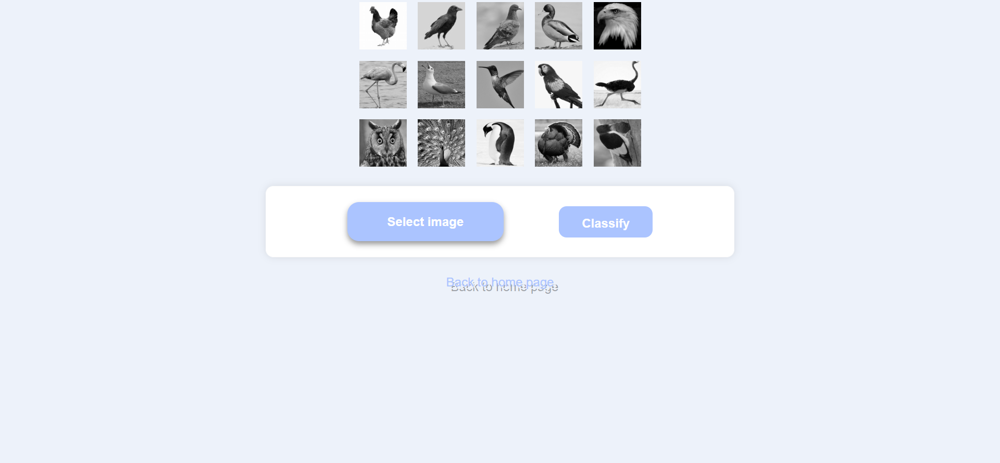
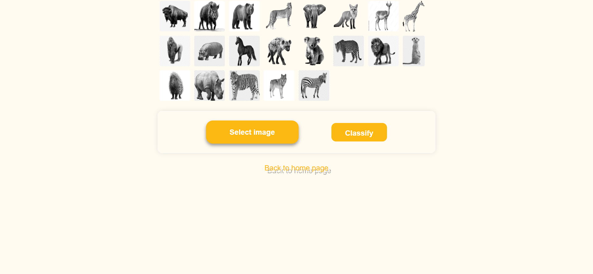
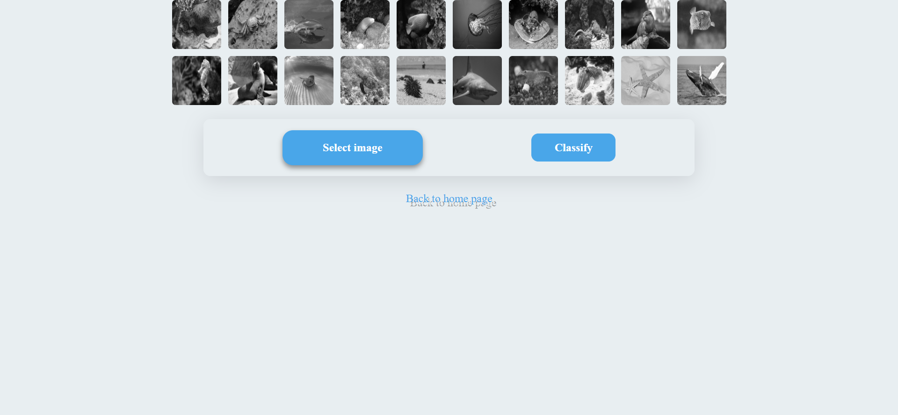
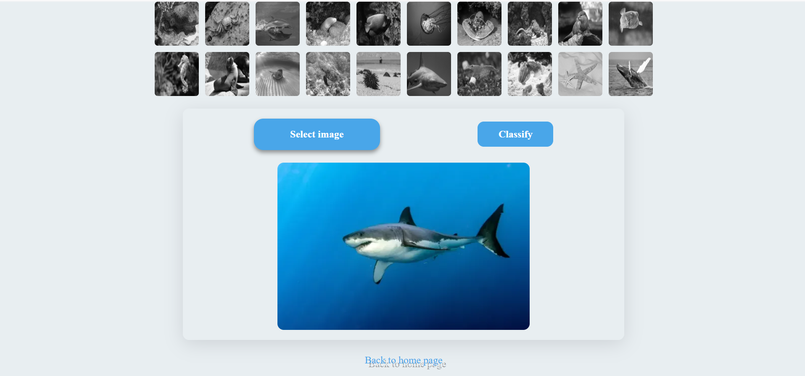
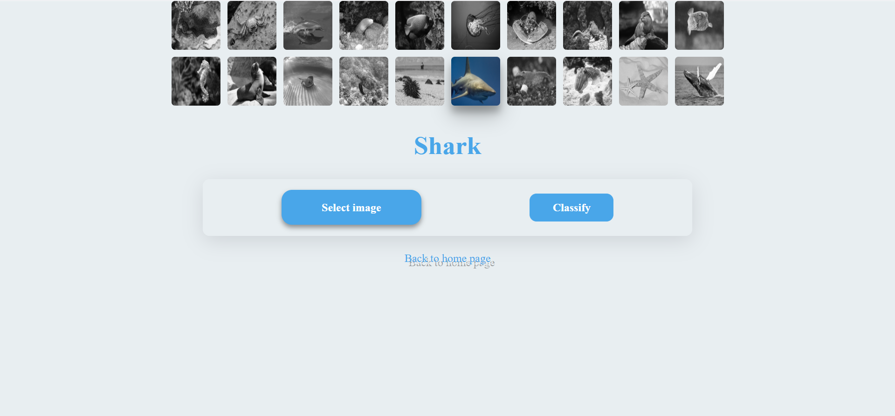
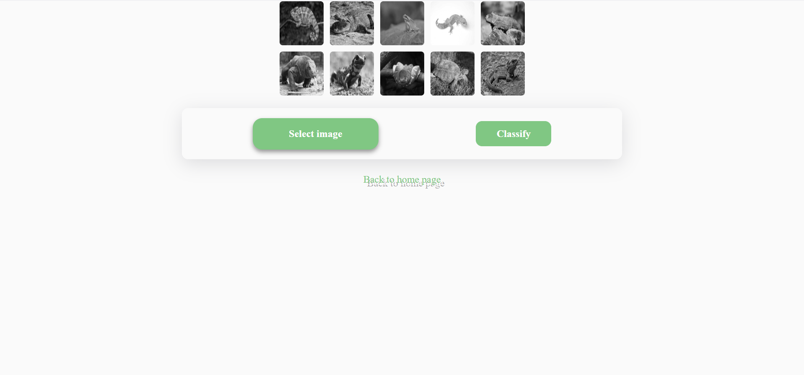

# Animals Image Classification

A collection of convolutional neural network (CNN) models for classifying images of various animal categories. The project supports:

* **Marine Species** (20 classes)
* **Reptiles & Amphibians** (10 classes)
* **Birds** (15 classes)
* **Wild Mammals** (21 classes)
* **Category-Agnostic** model for unknown images

All category-specific classifiers are built with TensorFlow and deployed via a Django web application.

---

## 📋 Table of Contents

1. [Features](#-features)
2. [Model Architecture](#-model-architecture)
3. [Data & Classes](#-data--classes)
4. [Installation](#-installation)
5. [Usage](#-usage)
6. [Project Structure](#-project-structure)
7. [Screenshots](#-screenshots)
8. [Contact](#-contact)

---

## 🔥 Features

* **High-Accuracy Classification**
  – Marine, reptile/amphibian, bird & wild-mammal models exceed 90% accuracy on held-out test sets.
* **Category-Agnostic Fallback**
  – A standalone CNN that guesses the correct animal category when the type is unknown.
* **Web Interface**
  – Image upload & real-time prediction via Django.
* **Modular Design**
  – Separate models & endpoints for each category.

---

## 🏗️ Model Architecture

| Category                   | Base CNN    | Description                                          |
| -------------------------- | ----------- | ---------------------------------------------------- |
| Marine Species (20)        | ResNet-101  | Pretrained on ImageNet, fine-tuned on marine dataset |
| Reptiles & Amphibians (10) | ResNet-101  | Same backbone, different class head                  |
| Wild Mammals (15)          | ResNet-101  | Same backbone, different class head                  |
| Birds (15)                 | MobileNetV2 | Lightweight model optimized for bird images          |
| Category-Agnostic          | Custom CNN  | Built from scratch to recognize any animal category  |

---

## 📊 Data & Classes

* **Marine Species** (20):
  – Examples: dolphin, shark, sea turtle, clownfish, manta ray…
  – **Dataset used:** [Marine Animal Dataset]([https://example.com/marine-dataset](https://www.kaggle.com/datasets/ismail703/marine-animals-dataset))

* **Reptiles & Amphibians** (10):
  – Examples: crocodile, gecko, frog, salamander, iguana…
  – **Dataset used:** [Reptile & Amphibian Dataset](https://www.kaggle.com/datasets/ismail703/reptiles-and-amphibians-dataset)

* **Birds** (15):
  – Examples: sparrow, eagle, parrot, penguin, flamingo…
  – **Dataset used:** [Bird Species Dataset](https://www.kaggle.com/datasets/elhaddadmohamed/birds-v4)

* **Wild Mammals** (15):
  – Examples: lion, tiger, elephant, bear, giraffe…
  – **Dataset used:** [Wild Mammals Dataset](https://www.kaggle.com/datasets/elhaddadmohamed/final-datasets-v2)

---

## 🚀 Installation

1. **Clone the repository**

   ```bash
   git clone https://github.com/yourusername/animals-image-classification.git
   cd animals-image-classification
   ```

2. **Create & activate a virtual environment**

   ```bash
   python3 -m venv venv
   source venv/bin/activate
   ```

3. **Install Python dependencies**

   ```bash
   pip install -r requirements.txt
   ```

4. **Apply migrations & collect static files**

   ```bash
   python manage.py migrate
   python manage.py collectstatic
   ```

---

## 🎯 Usage

1. **Train a model** :
   Execute the Jupyter Notebooks located in the notebook directory to get the models

2. **Start the Django development server**

   ```bash
   python manage.py runserver
   ```

   Open `http://localhost:8000/` in your browser.

3. **Upload & classify an image**

   * Select the appropriate category or choose “Click here”
   * View predicted label

---

## 📂 Project Structure

```
.
├── notebook/                   # Jupyter notebooks for building and training models
├── interface/                  # Django project settings and configuration
│   ├── __init__.py
│   ├── settings.py
│   ├── urls.py
│   ├── wsgi.py
│   └── asgi.py                # Standard Django project files
├── page/                       # Django app for classification UI and logic
│   ├── __init__.py
│   ├── admin.py
│   ├── apps.py
│   ├── forms.py
│   ├── models.py
│   ├── predict.py             # Model inference logic
│   ├── tests.py
│   ├── urls.py
│   ├── views.py
│   └── static/                # Static assets (CSS, JS, images)
├── templates/                  # HTML templates for each category and index
│   ├── index.html
│   ├── marine.html
│   ├── reptiles.html
│   ├── birds.html
│   ├── wild.html
│   └── unknown.html
├── requirements.txt            # Python dependencies
└── README.md                   # Project overview and instructions
```
---

## 🖼️ Screenshots

Below are sample screenshots of the web interface in action:








---

## 📬 Contact
[💼 LinkedIn ](www.linkedin.com/in/ismail-el-main)<br/>
[🐙 GitHub ](https://github.com/ismail703)


